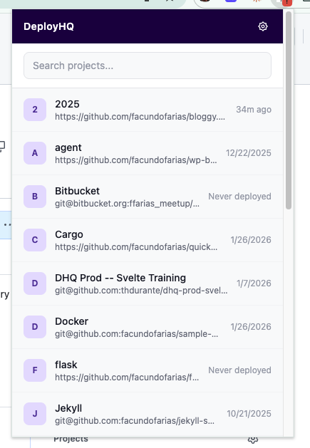
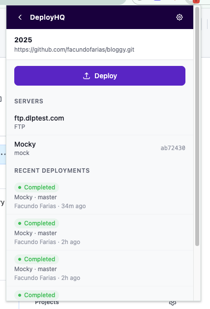
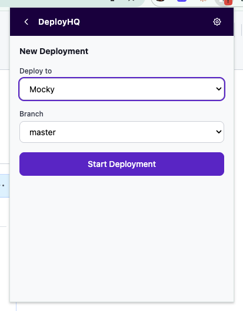
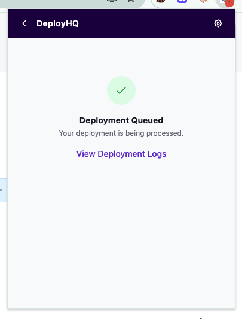

# DeployHQ Chrome Extension

A Chrome extension for [DeployHQ](https://www.deployhq.com) — an automated deployment platform that lets you deploy code from your Git repositories (GitHub, GitLab, Bitbucket, and more) to your servers via FTP, SFTP, SSH, and other protocols.

**Don't have an account?** [Sign up for free](https://www.deployhq.com/signup) — no credit card required.

## Features

- **Project Dashboard** — Browse all your DeployHQ projects and recent deployment history
- **One-Click Deploy** — Trigger deployments by selecting a server, branch, and revision
- **Git Platform Integration** — "Deploy with DeployHQ" button injected on GitHub, GitLab, and Bitbucket repository and PR pages
- **Connect Repos** — "Connect to DeployHQ" button on repos not yet linked, with project name and platform pre-filled
- **Real-Time Notifications** — Desktop notifications when deployments complete or fail
- **Status Badge** — Extension icon badge shows deployment status at a glance (running, failed, or clear)

## Screenshots

<p align="center">
  
  
</p>
<p align="center">
  
  
</p>

## Installation

### From the Chrome Web Store

1. Install the extension from the [Chrome Web Store](https://chrome.google.com/webstore) <!-- TODO: Add link -->
2. Click the DeployHQ icon in your browser toolbar
3. Enter your account subdomain, email, and API key
4. Find your API key in DeployHQ under **Profile > API Key** or visit your [account settings](https://www.deployhq.com/app)

### Load locally (development)

1. Clone this repository
2. Run `npm install && npm run build`
3. Open `chrome://extensions/` in Chrome
4. Enable **Developer mode**
5. Click **Load unpacked** and select the `dist/` folder

## How It Works

### Popup Dashboard

Click the DeployHQ icon in your toolbar to:

- View all your projects with latest deployment timestamps
- Search and filter projects
- Click a project to see its servers, server groups, and recent deployments
- Deploy to any server or group with branch selection

### Git Platform Buttons

When browsing repositories on GitHub, GitLab, or Bitbucket:

- **Matched repos** — If the repository is connected to a DeployHQ project, a "Deploy with DeployHQ" button appears. Clicking it opens the project detail view in a popup window.
- **Unmatched repos** — A "Connect to DeployHQ" button appears, linking to the new project form with the repository name and platform pre-filled.

## Development

```bash
npm install          # Install dependencies
npm run dev          # Build in watch mode
npm run build        # Production build (typecheck + vite build)
npm run typecheck    # TypeScript check only
```

## Tech Stack

- **TypeScript**, **React 18**, **Tailwind CSS 3**
- **Vite 5** with `@crxjs/vite-plugin` for Manifest V3 bundling
- **Chrome Extension Manifest V3** — service workers, content scripts, local storage

## Architecture

```
src/
  background/service-worker.ts   # Polling, badge updates, notifications, project matching
  popup/                         # React app (popup + windowed mode)
    pages/                       # Login, Dashboard, ProjectDetail, DeployForm, Settings
    components/                  # StatusBadge, Header, ErrorMessage, LoadingSpinner
  content/                       # Injected into git platform pages
    github.ts                    # GitHub repo/PR/branch pages
    gitlab.ts                    # GitLab repo/MR/branch pages
    bitbucket.ts                 # Bitbucket repo/PR/branch/source pages
    shared.ts                    # Button creation, styles, project matching, toast
  shared/                        # Used by all layers
    api.ts                       # DeployHQ API client (HTTP Basic Auth)
    types.ts                     # TypeScript types matching API responses
    storage.ts                   # Chrome storage wrapper
    constants.ts                 # Status colors, protocol labels
```

## API

Uses the [DeployHQ API](https://www.deployhq.com/docs/api) with HTTP Basic Authentication (`email:apiKey`).

## Security

- API credentials stored in `chrome.storage.local` (not synced across devices)
- All API calls over HTTPS only with `credentials: 'omit'` to prevent cookie leakage
- Content scripts use host permissions for git platforms
- No credentials are logged or exposed in console output

## License

MIT
